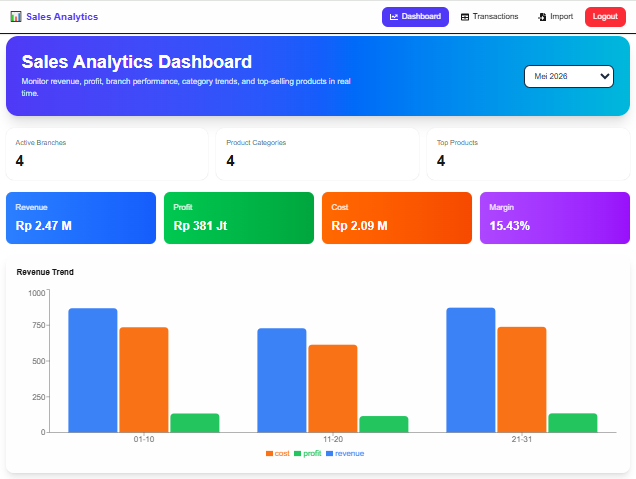

# 📊 Sales Analytics Dashboard

Modern Full Stack Sales Analytics Dashboard built with Next.js, React, Node.js, Express, MySQL and JWT Authentication.



---

## 🚀 Features

### Dashboard Analytics

- Revenue Summary
- Profit Summary
- Cost Summary
- Margin Calculation
- Revenue Trend Chart
- Category Performance Chart
- Branch Performance Chart
- Top Products Ranking

### Transaction Management

- Create Transaction
- Edit Transaction
- Delete Transaction
- Search Transaction
- Pagination
- Export Excel

### Import Data

- Import Sales Data from Excel
- Automatic Dashboard Update

### Authentication

- Register
- Login
- JWT Authentication
- Protected Routes
- Logout

---

## 🛠 Tech Stack

### Frontend

- Next.js 16
- React
- TypeScript
- Tailwind CSS
- Recharts
- SweetAlert2

### Backend

- Node.js
- Express.js
- JWT Authentication
- Multer
- XLSX

### Database

- MySQL

---

## 📂 Project Structure

### Frontend

```bash
frontend/
│
├── app/
│   ├── page.tsx
│   ├── login/
│   ├── register/
│   ├── transactions/
│   └── import/
│
├── components/
│   ├── Navbar.tsx
│   ├── KPISection.tsx
│   ├── RevenueChart.tsx
│   ├── CategoryChart.tsx
│   ├── BranchChart.tsx
│   └── TopProductsTable.tsx
│
└── data/
    └── api.ts
```

### Backend

```bash
backend/
│
├── src/
│   ├── controllers/
│   ├── routes/
│   ├── middlewares/
│   ├── config/
│   └── app.js
│
└── uploads/
```

---

## 📊 Database

### users

| Field | Type |
|---------|---------|
| id | bigint |
| name | varchar |
| email | varchar |
| password | varchar |

### sales_transactions

| Field | Type |
|---------|---------|
| id | bigint |
| transaction_date | date |
| branch | varchar |
| category | varchar |
| product_name | varchar |
| qty | int |
| revenue | decimal |
| cost | decimal |
| profit | decimal |

---

## 🔐 API Endpoints

### Authentication

```http
POST /api/auth/register
POST /api/auth/login
GET  /api/auth/me
```

### Dashboard

```http
GET /api/dashboard/months
GET /api/dashboard/summary?month=2026-05
GET /api/dashboard/trend?month=2026-05
GET /api/dashboard/category?month=2026-05
GET /api/dashboard/branch?month=2026-05
GET /api/dashboard/top-products?month=2026-05
```

### Transactions

```http
GET    /api/sales
POST   /api/sales
PUT    /api/sales/:id
DELETE /api/sales/:id
```

### Import & Export

```http
POST /api/sales/import
GET /api/sales/export
```

---

## ⚙️ Installation

### Clone Repository

```bash
git clone https://github.com/agusbest/sales-analytics-dashboard.git
```

---

## Backend Setup

```bash
cd backend

npm install
```

Create .env

```env
PORT=5000

DB_HOST=localhost
DB_PORT=3306
DB_USER=root
DB_PASSWORD=
DB_NAME=sales_analytics

JWT_SECRET=supersecretkey
```

Run server

```bash
npm run dev
```

Backend:

```bash
http://localhost:5000
```

---

## Frontend Setup

```bash
cd frontend

npm install
```

Create .env.local

```env
NEXT_PUBLIC_API_URL=http://localhost:5000/api
```

Run frontend

```bash
npm run dev
```

Frontend:

```bash
http://localhost:3000
```

---

## 📈 Future Improvements

- Role Permission
- Refresh Token
- Multi Branch Comparison
- Real Time Dashboard


---

## 👨‍💻 Author

Agus

Full Stack Developer

Tech Stack:

- Laravel
- PHP
- MySQL
- React
- Next.js
- Node.js
- Express.js

LinkedIn:
https://www.linkedin.com/in/agus-nugraha-dev

GitHub:
https://github.com/agusbest/sales-analytics-dashboard

---

## 📄 License

MIT License